# LAB-PatronesArquitecturales-AREP

## Empezando

>Para clonar el archivo 

>git clone https://github.com/nontoa/LAB-PatronesArquitecturales-AREP.git

### Prerrequisitos
* Maven
* Java
* Git

## Construido con

* [Maven](https://maven.apache.org/) - Gestión de dependencias

## Descripción:

### Aws RDS:

Con Amazon Relational Database Service (Amazon RDS), es sencillo configurar, utilizar y escalar una base de datos relacional en la nube. El servicio suministra capacidad rentable y escalable al mismo tiempo que automatiza las arduas tareas administrativas, como el aprovisionamiento de hardware, la configuración de bases de datos, la implementación de parches y la creación de copias de seguridad. Lo libera de estas tareas para que pueda concentrarse en sus aplicaciones y darles el rendimiento rápido, la alta disponibilidad, la seguridad y la compatibilidad que necesitan.

### Aws VPC:

Amazon Virtual Private Cloud (Amazon VPC) permite aprovisionar una sección de la nube de AWS aislada de forma lógica, en la que puede lanzar recursos de AWS en una red virtual que usted defina. Puede controlar todos los aspectos del entorno de red virtual, incluida la selección de su propio rango de direcciones IP, la creación de subredes y la configuración de tablas de ruteo y gateways de red. Puede usar tanto IPv4 como IPv6 en su VPC para obtener acceso a recursos y aplicaciones de manera segura y sencilla.

### Aws S3:

Amazon Simple Storage Service es un servicio de almacenamiento para Internet. Está diseñado para facilitar a los desarrolladores recursos de computación escalables basados en Web.

Amazon S3 tiene una interfaz de servicios web simple que puede utilizar para almacenar y recuperar cualquier cantidad de datos, en cualquier momento, desde cualquier parte de la web. Ofrece a cualquier desarrollador acceso a la misma infraestructura de almacenamiento de datos económica, altamente escalable, fiable, segura y rápida que utiliza Amazon para mantener su propia red global de sitios web. Este servicio tiene como fin maximizar los beneficios del escalado y trasladarlos a los desarrolladores.

En esta guía se explican los conceptos principales de Amazon S3, como los de bucket y objeto, y cómo trabajar con estos recursos con la interfaz de programación de aplicaciones (API) de Amazon S3.

### Aws EC2:

Amazon Elastic Compute Cloud (Amazon EC2) es un servicio web que proporciona capacidad informática en la nube segura y de tamaño modificable. Está diseñado para simplificar el uso de la informática en la nube a escala web para los desarrolladores.

La sencilla interfaz de servicios web de Amazon EC2 permite obtener y configurar capacidad con una fricción mínima. Proporciona un control completo sobre los recursos informáticos y puede ejecutarse en el entorno informático acreditado de Amazon. Amazon EC2 reduce el tiempo necesario para obtener e iniciar nuevas instancias de servidor en cuestión de minutos, lo que permite escalar rápidamente la capacidad, ya sea aumentándola o reduciéndola, en función de sus necesidades. Amazon EC2 cambia el modelo económico de la informática al permitir pagar solo por la capacidad que utiliza realmente. Amazon EC2 les brinda a los desarrolladores las herramientas necesarias para crear aplicaciones resistentes a errores y para aislarlas de los casos de error comunes.

Para más información visitar la página oficial de AWS. ( https://aws.amazon.com/es/ )

## Videos Tutoriales:

* Desplegar un sitio estático usando S3 [Tutorial 1](https://youtu.be/rKrSGYihZhU).
* Configurar un VPC para gestionar la seguridad y los permisos de acceso a sus servidores [Tutorial 2](https://youtu.be/u5Jy7aAGWkc). 
* Crear base de datos con RDS en AWS [Tutorial 3](https://youtu.be/UQy27aSQXGc).
* Desplegar aplicación con EC2 [Tutorial 4](https://youtu.be/-ayoOywtrhY).

## Tutorial S3:

### 1. Desplegar un sitio estático usando S3.

#### Iniciar sesión en su cuenta de AWS:

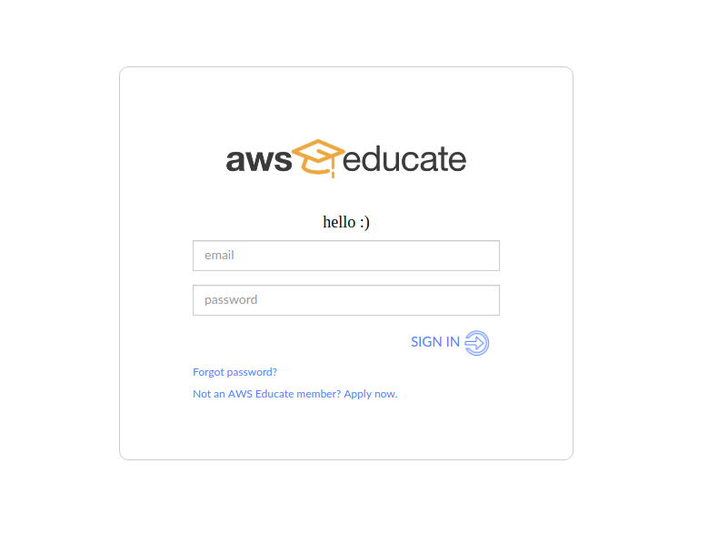

#### Ingresar a AWS Account:

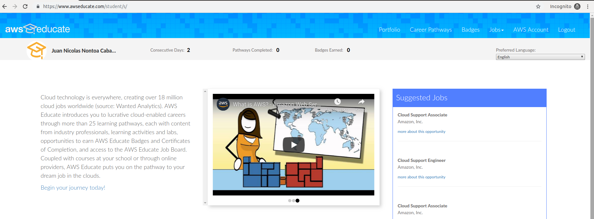

#### Ingresar a AWS Educate Starter Account:

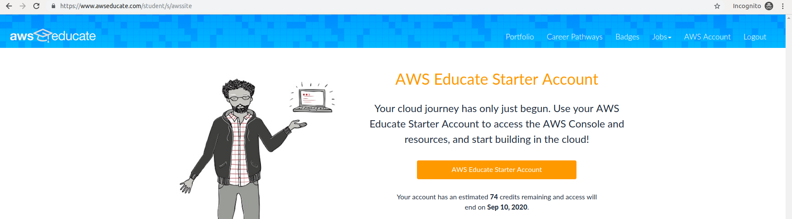

#### Ingresar a AWS Console:

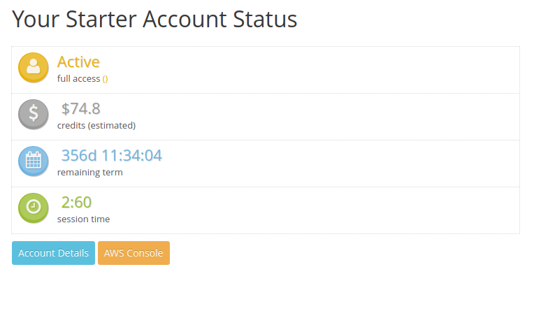

#### Ingresar al servicio de S3:

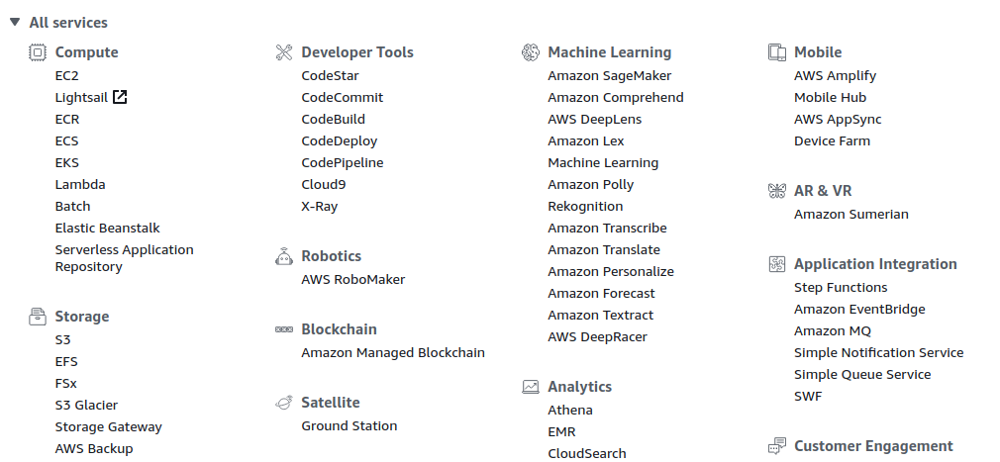

#### Crear un nuevo Bucket:

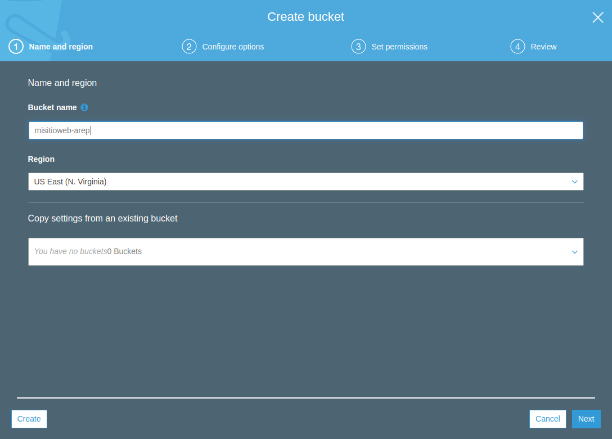
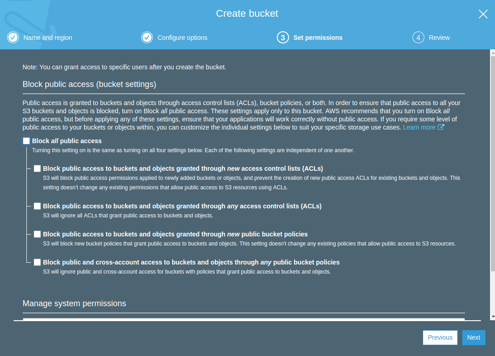
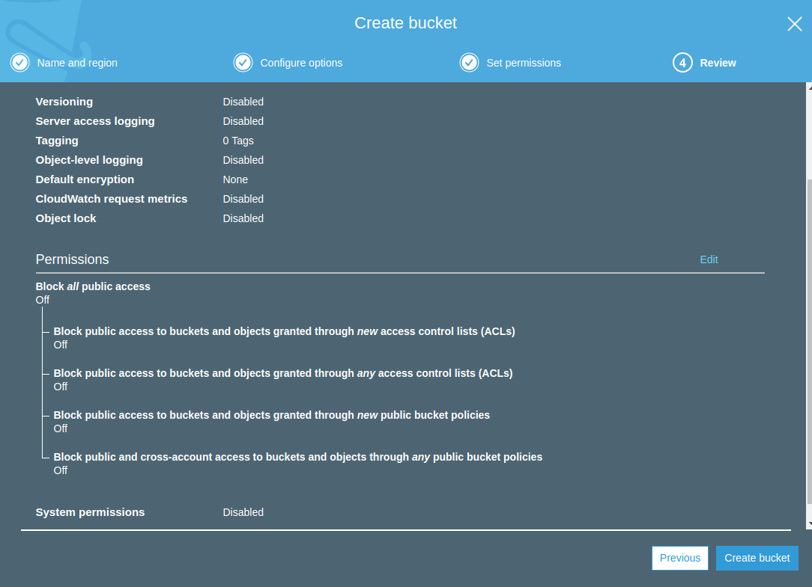
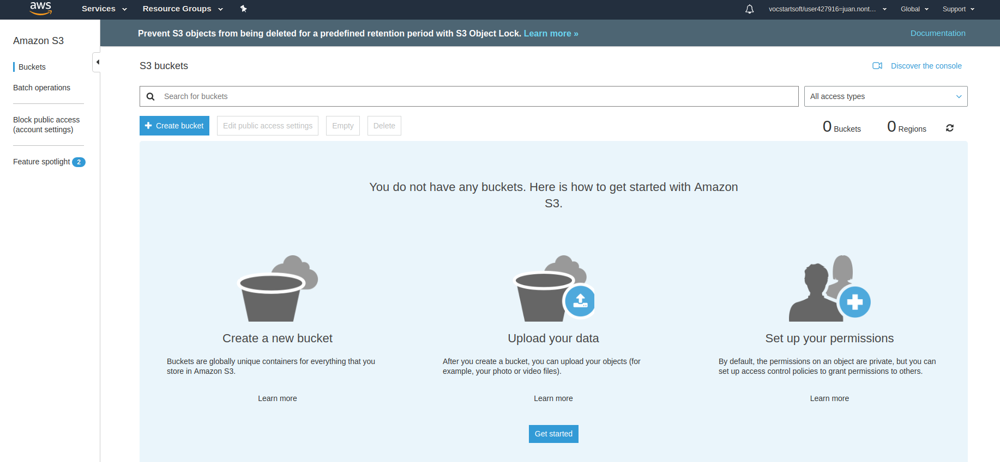
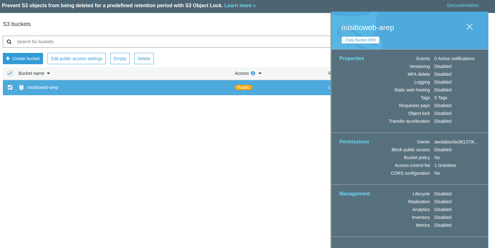

#### Ir a las propiedades del Bucket creado anteriormente:

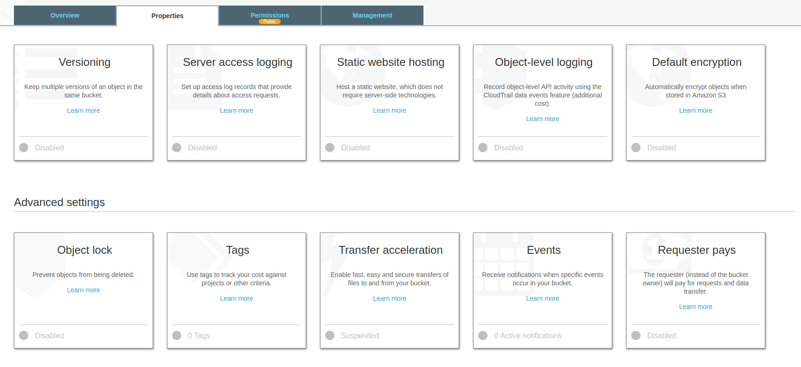

#### Entrar a Static Web Hosting y poner las siguientes propiedades:

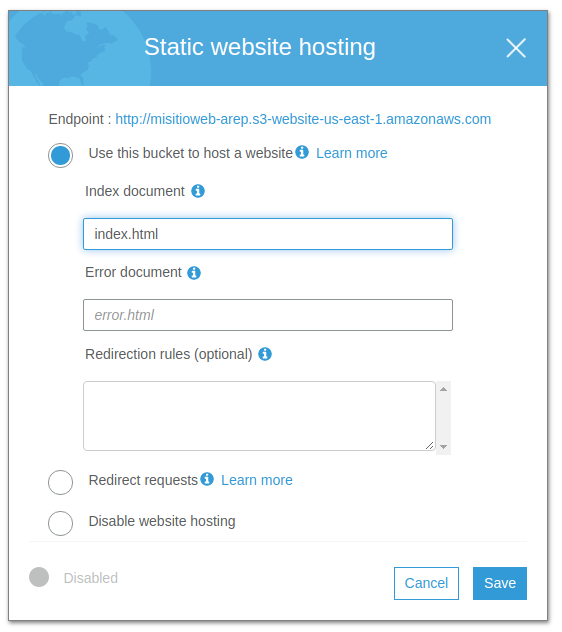

#### Ir a la pestaña permissions y copiar el siguiente código:

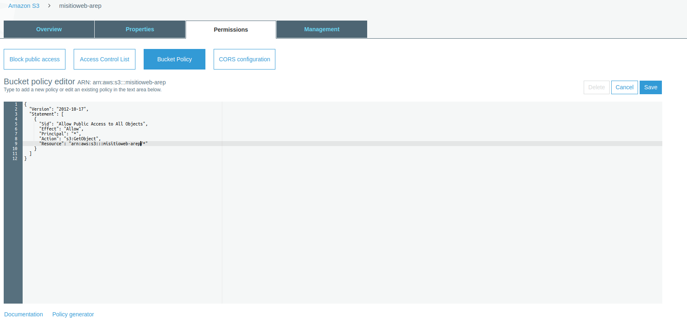

#### Ir a la pestaña overview y subir el archivo index.html dado en este repositorio:

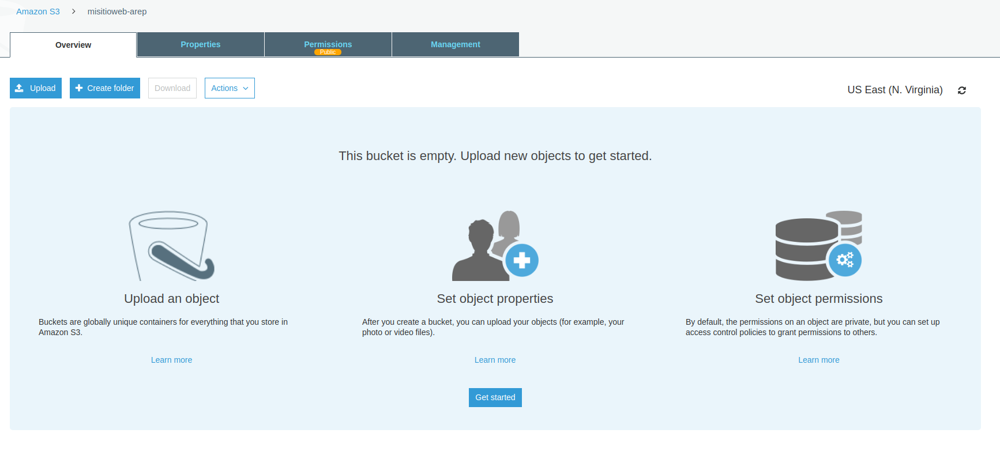
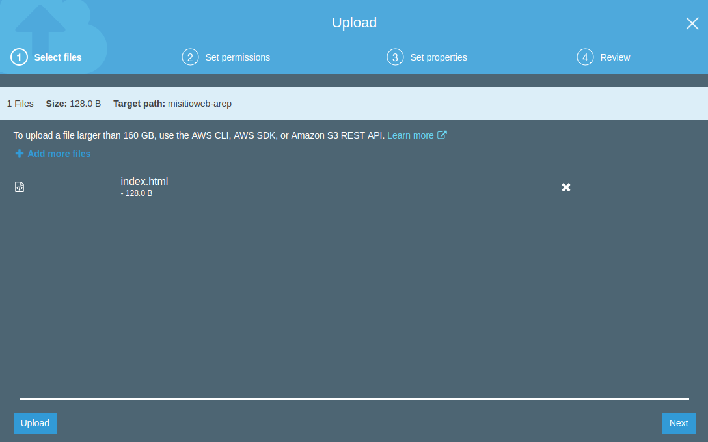
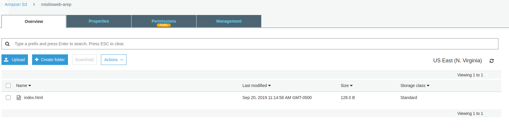

#### Ir a estatic web hosting:

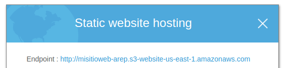

#### Cuando ingrese al link dado aparecera esta página:

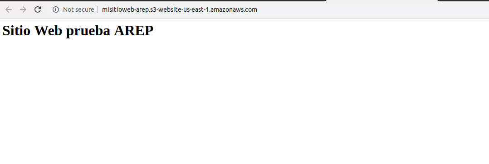

## Autor

* **Juan Nicolas Nontoa Caballero**  LAB-PatronesArquitecturales-AREP - [nontoa] (https://github.com/nontoa)

## Licencia

Este proyecto está licenciado bajo la Licencia GNU - vea el archivo [LICENSE](LICENSE) para más detalles.
